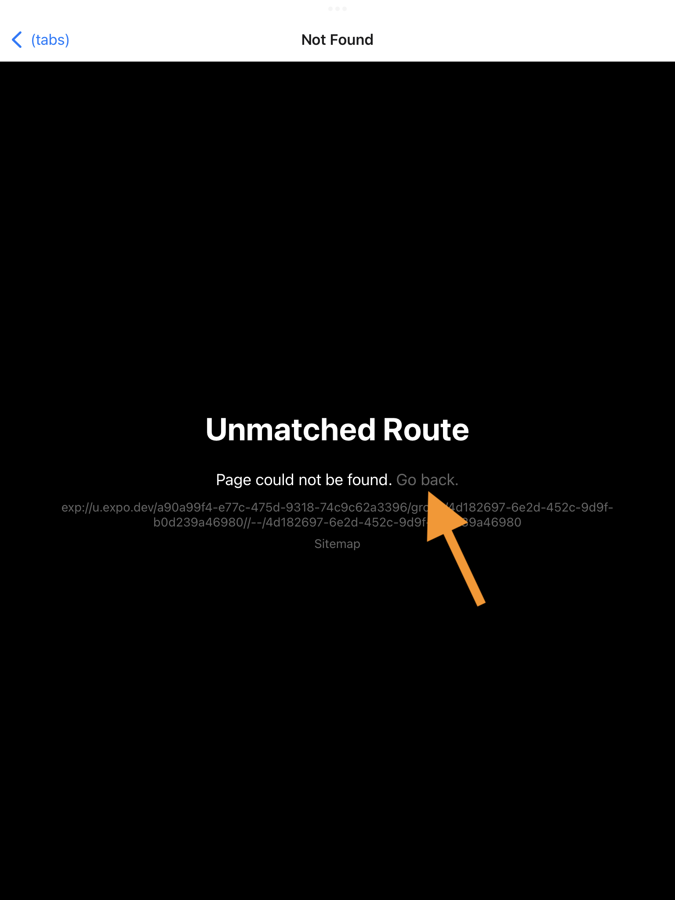

# Opening the Scouting App

The Scouting App should already be open. It not, here's how to run it:

## 1: Open the Expo Application

Expo is a host for the Scouting App. Its icon is an inverted "V".

## 2: Select "Scouter"

Our app is called "Scouter"

## 3: If you experience the "Unmatched Route" error, just select "Go back"

Don't panic, this is a simple issue to fix.

# Using the Scouting App

### Match Scouting

This is the screen from which you will select the Match and Team you will be Match scouting. Note that there is a practice or training Match that you can go through any time you want. Noting you do in here will break anything so don't worry.

Matches will only be listed if The Blue Alliance has updated their data.

**This screen supports "Pull to Refresh" which updates the following:**

- Teams listed. The Blue Alliance may make changes to Matches or Teams. We will pull those changes and store them in "The Cloud". Pulling to refresh then retrieves them from the cloud to the iPad.
- Match Scouting sessions that have been uploaded. If you're not sure which Matches and Teams have been scouted and uploaded, you can pull to refresh and the app will show the state by changing the button styles.

### Match Scouting Results

This is the screen from which you manually upload Match Scouting results or manually handle the raw data. At some venues, we do not have robust wifi and we must connect the iPad to a hotspot or other temporary connection and trigger uploads. This is where that happens.

Scouters do not need to worry about this screen unless instructed by Game or Scouting management.

### Pit Scouting

This is where you will select the Team for Pit Scouting. Like Match scouting, there is a practice or training Team you can use whenever you like. This allows you to look at and play around with the questions without assigning the answers to an actual team.

**This screen supports "Pull to Refresh" which updates the following:**

- Teams listed. The Blue Alliance may make changes to Teams. We will pull those changes and store them in "The Cloud". Pulling to refresh then retrieves them from the cloud to the iPad.
- Pit Scouting sessions that have been uploaded. If you're not sure which Teams have been scouted and uploaded, you can pull to refresh and the app will show the state by changing the button styles.

